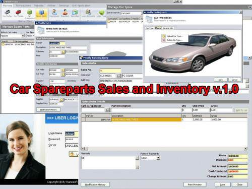



## Car Sparepart Point of Sales 

### Description

Car Spareparts Sales and Inventory System is a program that uses ADO and some good functionalities. It uses listview control in displaying list of records,flexgrid and other activex controls that beautify the interface of the system.

Download this code and you will learn more in Visual Basic programming, such as the used API in database programming, custom functions and procedures to optimize your codes, data dynamic reporting, string manipulation and etc.

For ocx and dll files, please don't hesitate to contact me.

Thank you and I hope this could help you in your programming.

Please email me if you have queries, suggestions or drop a comment to this post. Have a nice day and God Bless.

ActiveX Download:

http://www.ziddu.com/downloadlink/18731470/lvButton.zip

http://www.ziddu.com/downloadlink/18731469/b8Controls.zip

http://www.ziddu.com/downloadlink/18731468/lvbuttons.zip

http://www.ziddu.com/downloadlink/18731454/HookMenu.zip

http://www.ziddu.com/downloadlink/18731456/NSStyleButton.zip

http://www.ziddu.com/downloadlink/18731463/NSDataCombo.zip

http://www.ziddu.com/downloadlink/18731468/lvbuttons.zip

Credits goes to:

Philip V. Naparan

and PSCODE moderators

Happy programming-: )
 
### More Info
 

             |
---                |---
**Submitted On**   |2012-02-16 10:44:08
**By**             |[Leomar  V\. Ramos](https://github.com/Planet-Source-Code/PSCIndex/blob/master/ByAuthor/leomar-v-ramos.md)
**Level**          |Intermediate
**User Rating**    |2.8 (17 globes from 6 users)
**Compatibility**  |VB 6\.0
**Category**       |[Complete Applications](https://github.com/Planet-Source-Code/PSCIndex/blob/master/ByCategory/complete-applications__1-27.md)
**World**          |[Visual Basic](https://github.com/Planet-Source-Code/PSCIndex/blob/master/ByWorld/visual-basic.md)
**Archive File**   |[Car\_Sparep2220782282012\.zip](https://github.com/Planet-Source-Code/leomar-v-ramos-car-sparepart-point-of-sales__1-74291/archive/master.zip)

